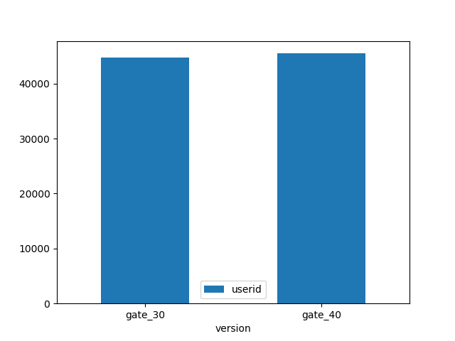
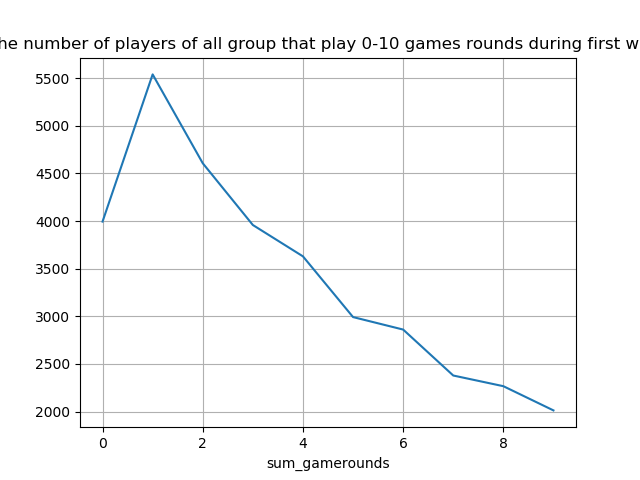
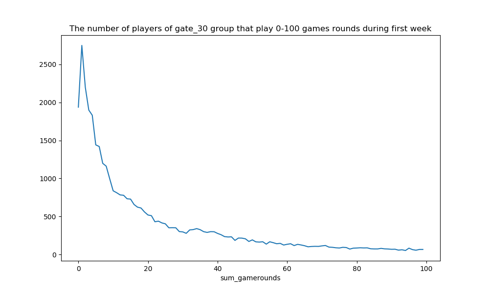
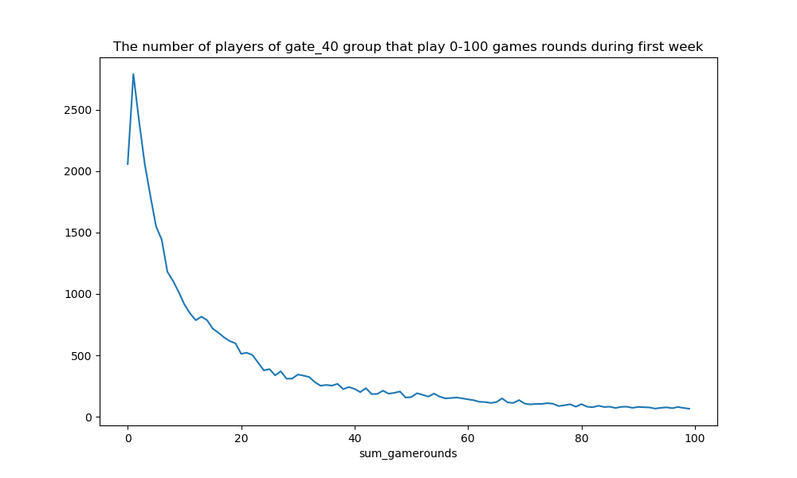

## DATA EXPLORATION

- Range of data: 90189 rows, 5 columns.

        userid            90189 non-null int64
        version           90189 non-null object
        sum_gamerounds    90189 non-null int64
        retention_1       90189 non-null bool
        retention_7       90189 non-null bool

- The dataset includes observations from 2 groups: gate_30 and gate_40. Gate_30 is considered control group and gate_40 is test group

As the distribution of players in each group below, the numbers are roundly equal: 

## Distribution of game rounds
Next, we explore more about statistical summary of each group. 

        version     count       mean         std  min  25%   50%   75%      max                                                           
        gate_30  44700.0  52.456264  256.716423  0.0  5.0  17.0  50.0  49854.0
        gate_40  45489.0  51.298776  103.294416  0.0  5.0  16.0  52.0   2640.0

As in the summary, the mean values of 2 groups is about the same, as well as their min, 25 50 75 percentile. There are outliers who played up to 49000 rounds in control group and 2600 rounds in test group. However, there are only 2 rare cases like that.

More detail about game rounds distribution: 

Generally, there are total about 4000 players who play 0 round from the game. 

The distributions of two group look alike. More importantly, there is a skewed of the distribution until round 20 in both groups. Until round 60, the distribution seem to be steady

Somehow, this is a signal that the retention of players is quite sensitive to number of rounds they played.

## Retention Rate

- General retention rate after 1 day is 44.52 %
- General retention rate after 7 day is 18.61 %

####1- Retention rate Day 1
    gate_30    44.818792
    gate_40    44.228275

Hypothesis: The retention rate of control group (gate_30) is higher than test group (gate_40)
- T-test 
    
    
    t_value: 1.7840774867039824
    p_value: 0.07441443713953834
The difference is not significant. Hypothesis is not supported

####2- Retention rate by group Day 7

    gate_30    19.020134
    gate_40    18.200004

Hypothesis: The retention rate of control group (gate_30) is higher than test group (gate_40)
- T-test 

    t_value: 3.164028946774232
    p_value: 0.001556530181006652

The different is significant since the p value is < 0.05. Hypothesis is supported 